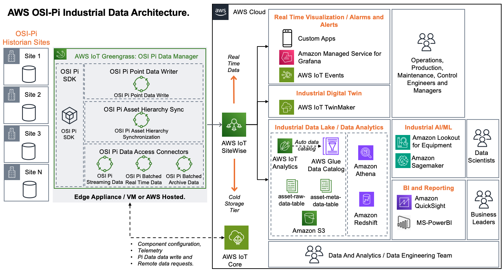

# OSI Pi Streaming Data Connector

The OSI Pi Streaming Data Connector provides real-time data ingestion from OSI Pi to the AWS Industrial Data Architecture shown below. The connector is an [AWS IoT Greengrass component](https://docs.aws.amazon.com/iot/latest/developerguide/what-is-aws-iot.html) that integrates to the Rest'ful PiWebAPI to access and ingest real-time streaming data over WebSocket’s from OSI Pi to AWS IoT Sitewise.

## Getting Started and Usage

For detailed deployment and usage guide see the [AWS OSI Pi Streaming Data Collector Developers Guide](aws-osi-pi-streaming-connector-developers-guide.pdf)

## Giving Feedback and Contributions

*   [Contributions Guidelines](CONTRIBUTING.md)
*   Submit [Issues, Feature Requests or Bugs](https://github.com/awslabs/osi-pi-streaming-data-connector/issues)

## AWS IoT Resources

*   [AWS IoT Core Documentation](https://docs.aws.amazon.com/iot/)
*   [AWS IoT Developer Guide](https://docs.aws.amazon.com/iot/latest/developerguide/what-is-aws-iot.html)
*   [AWS IoT Greengrass Documentation](https://docs.aws.amazon.com/greengrass/)
*   [AWS IoT Greengrass Developer Guide](https://docs.aws.amazon.com/greengrass/v2/developerguide/what-is-iot-greengrass.html)
*   [AWS IoT Sitewise](https://aws.amazon.com/iot-sitewise/)

## Security

See [CONTRIBUTING](CONTRIBUTING.md#security-issue-notifications) for more information.

## License

This project is licensed under the Apache-2.0 License.
