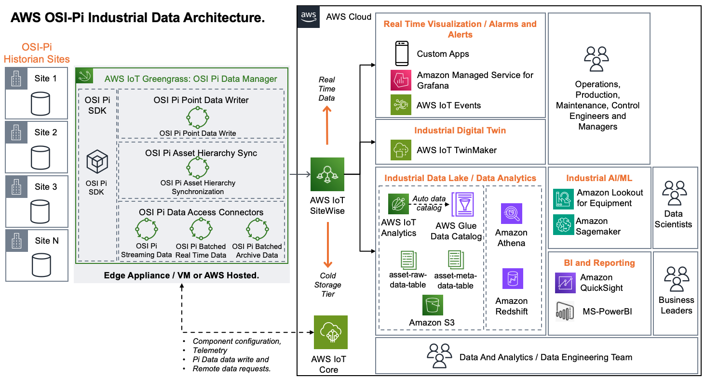

# AWS OSI Pi SDK 

This library is an SDK wrapper around the [Pi WebAPi]( https://docs.aveva.com/en-US/bundle/pi-web-api-reference/page/help/getting-started.html), a RESTful interface to the OSI Pi system. This SDK provides methods to query the OSI Pi Asset Framework for asset inventory and meta-data and access to the list of assets and data tags stored in the OSI Pi Data Archive.

This library is not a stand-alone solution and is intended to be a common import in a range of connector solutions that interface customers OSI Pi data management systems with a modern data architecture on AWS.

## AWS OSI Pi Historian Industrial Data Architecture



## OSI Pi: Industrial Historian Overview
OSI PI (Now Aveva Pi) is an industrial data historian for collecting, enriching, storing, and accessing industrial data. [Analysist](https://www.verdantix.com/insights/blogs/aveva-s-5-billion-osisoft-acquisition-reshapes-the-industrial-software-landscape) indicate that elements of the PI System are deployed at more than 20,000 sites worldwide, have been adopted by over 1,000 power utilities and manage data flows from close to 2 billion real-time sensors.

The OSI Pi systems consists of a number of software and data management solutions, primarily the OSI Pi Data Archive and the OSI Pi Asset Framework. The OSI Pi Data Archive is a proprietary industrial time-series database that manages data points that are referred to as data tags (or just tags). These data tags are generated from sensors and physical devices, a large Pi Data Archive can maintain data for over a million data tags. The Asset framework allows industrial control engineers to manage asset inventory and hierarchy, data point Unit of Measures (UoM) and other relevant data point meta-data. The Asset Framework backed is by MS-SQL. Asset entries in the Asset Framework can maintain a reference to a data tag in the Pi Data Archive that adds meaning to the otherwise non-contextualised timeseries data. 

The OSI Pi system is deployed on the Window Server operating system and provides a number of interfaces and integrations to access both the Pi Asset Framework and the Pi Data Archive. These include OLDBC / SQL connectors, .NET based SDK (AF-SDK) and a REST'ful web interface via the Pi WebAPI.

## Installation
This particular library is not individually deployable. It is intended to be a submodule in other OSI Pi connectors from within hte AWS OSI Pi Integeration Libraries to provide access to the OSI Pi data and asset management systems. 

To import into an existing Git repository / project:
```
git add submodule git@ssh.gitlab.aws.dev:aws-osi-pi-integeration-library/osi-pi-sdk.git
```

## Support
TBA

## Roadmap
TBA

## Contributing
TBA

## Authors and acknowledgment
TBA


## Contributing

We need your help in making this SDK great. Please participate in the community and contribute to this effort by submitting issues, participating in discussion forums and submitting pull requests through the following channels.
  
  TBA of Open Source Repo:
    Contributions Guidelines
    Submit Issues, Feature Requests or Bugs

## License
See the [LICENSE](LICENSE) file for our project's licensing. We will ask you to confirm the licensing of your contribution.